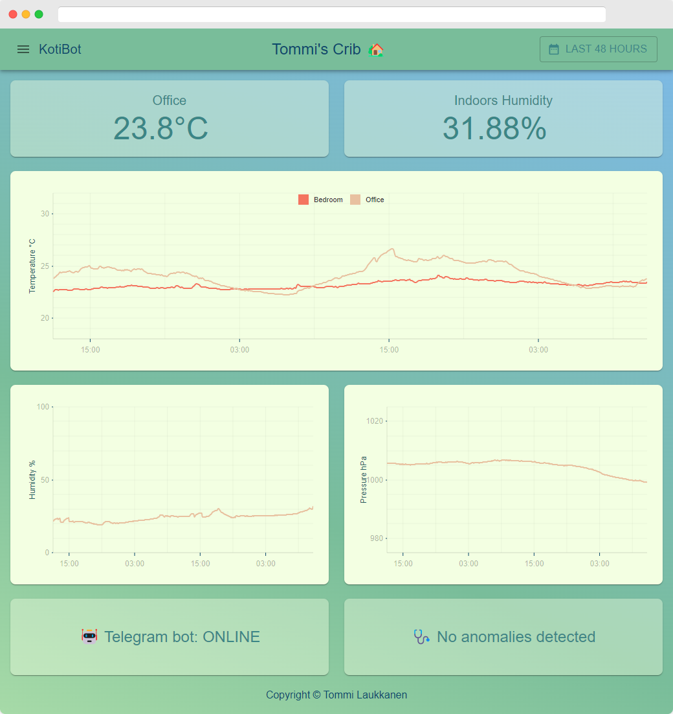

# Kotibot Web App

Checkout the [Demo](https://kotibot.azurewebsites.net/)

This is a small web app to display information from the sensor in my house

Technologies used:
* React for front-end
* .NET Core for backend API

# Setup

I'm using Raspberry Pi with DHT-22 sensor to publish temperature data to app. App stores the data to SQL Server and uses small React app to render chart of the most recent data.